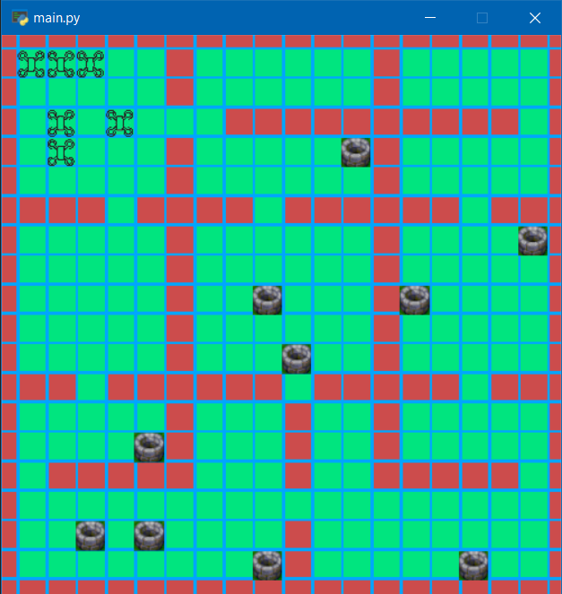

# Multi Agent Allocation with Generative Network

 

## Recommended system
Recommended system (tested):
- Windows
- Python 3.8.8

Python packages used by the example provided and their recommended version:
- pytorch==1.7.1
- gym==0.18.0
- numpy==1.19.2
- matplotlib==3.3.4
- tensorboard==2.5.0
- scipy==1.6.2
- pandas==1.3.0

## Training
You can configure some settings in `train.py` (number of episodes, evaluation interval) and layer/action numbers in `dqn_model.py` and the other settings (reward structure, maximum allowable prizes, collision dynamics etc.) in `point_mass_formation.py`
